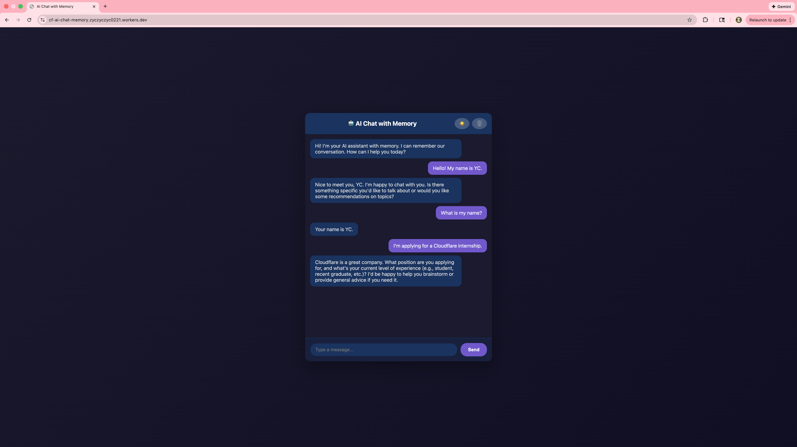
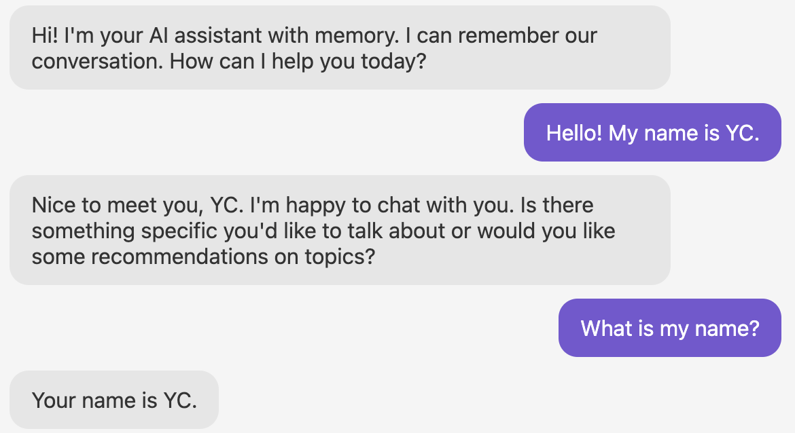

# AI Chat with Memory

Built on Cloudflare Workers with Durable Objects for persistent conversation memory.

🔗 **Live Demo**: https://cf-ai-chat-memory.zyczzyc0221.workers.dev

---

## Screenshots

### Light Mode


### Dark Mode  


### Memory Demo


---

## What It Does

A chatbot that remembers your conversation. Ask it your name, and it'll remember for the rest of the session.

**Tech stack:**
- Cloudflare Workers (serverless runtime)
- Durable Objects (persistent storage)
- Workers AI (Llama 3.1 8B)
- Vanilla JavaScript (no frameworks)

---

## Features

**Core:**
- Conversational AI with memory
- Persistent chat history per session
- Edge deployment (sub-200ms cold starts)

**Extras:**
- Clear memory button
- Dark mode (saves preference)
- Typing indicator
- Auto-prune history (keeps last 20 messages)

---

## Running Locally
```bash
git clone https://github.com/YichenZeng221/cf_ai_chat_memory.git
cd cf_ai_chat_memory
wrangler dev
```

Open `http://localhost:8787`

---

## Deployment
```bash
wrangler login
wrangler deploy
```

Your bot will be live at `https://cf-ai-chat-memory.YOUR_SUBDOMAIN.workers.dev`

---

## How It Works

### Memory Management

Messages are stored in a Durable Object. Each session gets its own instance:
```javascript
const id = env.CHAT_MEMORY.idFromName("session-1");
const stub = env.CHAT_MEMORY.get(id);
```

History is capped at 20 messages to avoid token limits:
```javascript
if (history.length > 20) history.shift();
```

### AI Integration

Conversation history is sent to Llama 3.1 8B:
```javascript
const messages = [
    { role: "system", content: "You are a helpful AI assistant." },
    ...history
];

const response = await env.AI.run("@cf/meta/llama-3.1-8b-instruct", {
    messages,
    max_tokens: 300
});
```

---

## Why These Choices?

**Durable Objects over KV:**  
Need strong consistency for sequential message ordering.

**20-message limit:**  
Balances context window vs. token costs.

**Embedded HTML:**  
No build step, simpler deployment.

---

## Project Structure
```
cf_ai_chat_memory/
├── worker/
│   └── index.js          # Worker code + embedded HTML
├── screenshots/          # UI demos
├── wrangler.toml         # Cloudflare config
└── README.md
```

---

## Future Ideas

- Multi-user sessions (generate unique IDs)
- Export chat history
- Streaming responses
- Voice input

---

## Built For

Cloudflare Software Engineering Internship — Optional Assignment

Demonstrates:
- Serverless architecture
- State management with Durable Objects
- AI model integration
- Production deployment

---

## License

MIT

---

**YC (Yichen Zeng)**  
GitHub: [@YichenZeng221](https://github.com/YichenZeng221)